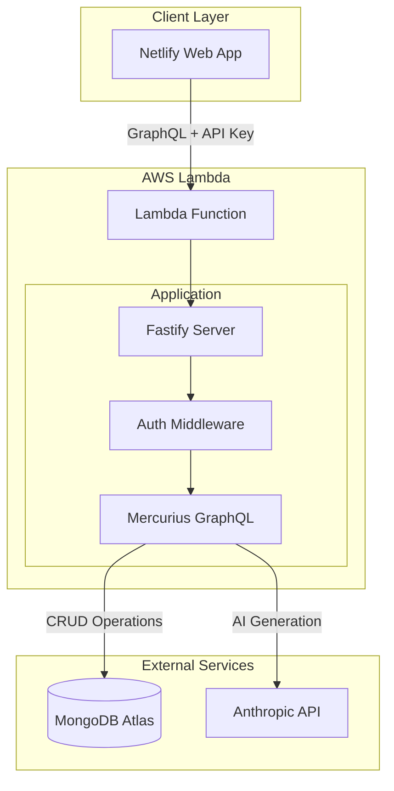
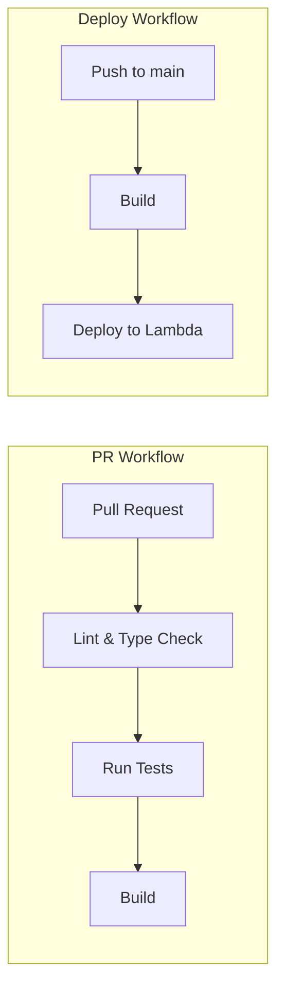

# Design Document: Career Data API

## Overview

The Career Data API is a GraphQL-based serverless web service that provides CRUD operations for career data (profile, experiences, skills, projects, educations) stored in MongoDB, along with AI-powered generation of tailored resumes, cover letters, and application answers using the Anthropic API.

The service is built with:

- **Fastify** - High-performance Node.js web framework
- **Mercurius** - GraphQL adapter for Fastify
- **MongoDB** - Document database for career data storage
- **Anthropic SDK** - AI integration for document generation
- **AWS Lambda** - Serverless deployment platform

## Architecture



### Request Flow

1. Client sends GraphQL request with `X-API-Key` header
2. Lambda receives request via Function URL
3. Fastify processes request through auth middleware
4. Mercurius parses and validates GraphQL query/mutation
5. Resolvers execute business logic
6. For CRUD: MongoDB operations via cached connection
7. For AI generation: Fetch career data, call Anthropic API
8. Response returned through GraphQL layer

## Components and Interfaces

### Project Structure

```
career-data-api/
├── src/
│   ├── index.ts              # Lambda handler entry point
│   ├── server.ts             # Fastify server setup
│   ├── schema/
│   │   ├── index.ts          # Schema composition
│   │   ├── types.graphql     # GraphQL type definitions
│   │   └── resolvers.ts      # Query/mutation resolvers
│   ├── services/
│   │   ├── mongodb.ts        # MongoDB connection & operations
│   │   └── anthropic.ts      # Anthropic API integration
│   ├── middleware/
│   │   └── auth.ts           # API key authentication
│   └── utils/
│       └── prompts.ts        # AI prompt builders
├── package.json
├── tsconfig.json
└── template.yaml             # SAM deployment template
```

### Core Interfaces

```typescript
// MongoDB Service Interface
interface MongoDBService {
  connect(): Promise<Db>;
  getCollection<T>(name: string): Collection<T>;
}

// Career Data Types
interface Profile {
  _id?: ObjectId;
  personalInfo: PersonalInfo;
  positioning: Positioning;
  valuePropositions: string[];
  professionalMission: string;
  uniqueSellingPoints: string[];
  updatedAt: Date;
}

interface Experience {
  _id?: ObjectId;
  company: string;
  location: string;
  title: string;
  industry?: string;
  startDate: Date;
  endDate?: Date;
  roleTypes: string[];
  responsibilities: string[];
  achievements: Achievement[];
  technologies: string[];
  featured: boolean;
  createdAt: Date;
  updatedAt: Date;
}

interface Skill {
  _id?: ObjectId;
  name: string;
  roleRelevance: string;
  level: string;
  rating: number;
  yearsOfExperience: number;
  tags: string[];
  keywords: string[];
  createdAt: Date;
  updatedAt: Date;
}

interface Project {
  _id?: ObjectId;
  name: string;
  type: string;
  date?: Date;
  featured: boolean;
  overview: string;
  challenge?: string;
  approach?: string;
  outcome?: string;
  impact?: string;
  technologies: string[];
  keywords: string[];
  roleTypes: string[];
  createdAt: Date;
  updatedAt: Date;
}

interface Education {
  _id?: ObjectId;
  institution: string;
  degree: string;
  field: string;
  graduationYear: number;
  relevantCoursework: string[];
  createdAt: Date;
  updatedAt: Date;
}

// AI Generation Types
interface JobInfo {
  description: string;
  jobType: string;
}

interface GenerationResult {
  content: string;
  usage: TokenUsage;
}

interface TokenUsage {
  inputTokens: number;
  outputTokens: number;
  cacheReadInputTokens?: number;
  cacheCreationInputTokens?: number;
}
```

### GraphQL Schema

```graphql
# Types
type Profile {
  id: ID!
  personalInfo: PersonalInfo!
  positioning: Positioning!
  valuePropositions: [String!]!
  professionalMission: String!
  uniqueSellingPoints: [String!]!
  updatedAt: DateTime!
}

type Experience {
  id: ID!
  company: String!
  location: String!
  title: String!
  industry: String
  startDate: DateTime!
  endDate: DateTime
  roleTypes: [String!]!
  responsibilities: [String!]!
  achievements: [Achievement!]!
  technologies: [String!]!
  featured: Boolean!
  createdAt: DateTime!
  updatedAt: DateTime!
}

type Skill {
  id: ID!
  name: String!
  roleRelevance: String!
  level: String!
  rating: Int!
  yearsOfExperience: Int!
  tags: [String!]!
  keywords: [String!]!
  createdAt: DateTime!
  updatedAt: DateTime!
}

type Project {
  id: ID!
  name: String!
  type: String!
  date: DateTime
  featured: Boolean!
  overview: String!
  challenge: String
  approach: String
  outcome: String
  impact: String
  technologies: [String!]!
  keywords: [String!]!
  roleTypes: [String!]!
  createdAt: DateTime!
  updatedAt: DateTime!
}

type Education {
  id: ID!
  institution: String!
  degree: String!
  field: String!
  graduationYear: Int!
  relevantCoursework: [String!]!
  createdAt: DateTime!
  updatedAt: DateTime!
}

# AI Generation Results
type GenerationResult {
  content: String!
  usage: TokenUsage!
}

type TokenUsage {
  inputTokens: Int!
  outputTokens: Int!
  cacheReadInputTokens: Int
  cacheCreationInputTokens: Int
}

# Queries
type Query {
  profile: Profile
  experiences(filter: ExperienceFilter): [Experience!]!
  experience(id: ID!): Experience
  skills(filter: SkillFilter): [Skill!]!
  skill(id: ID!): Skill
  projects(filter: ProjectFilter): [Project!]!
  project(id: ID!): Project
  educations(filter: EducationFilter): [Education!]!
  education(id: ID!): Education
}

# Mutations
type Mutation {
  # Profile
  updateProfile(input: ProfileInput!): Profile!

  # Experiences
  createExperience(input: ExperienceInput!): Experience!
  updateExperience(id: ID!, input: ExperienceInput!): Experience!
  deleteExperience(id: ID!): DeleteResult!

  # Skills
  createSkill(input: SkillInput!): Skill!
  updateSkill(id: ID!, input: SkillInput!): Skill!
  deleteSkill(id: ID!): DeleteResult!

  # Projects
  createProject(input: ProjectInput!): Project!
  updateProject(id: ID!, input: ProjectInput!): Project!
  deleteProject(id: ID!): DeleteResult!

  # Educations
  createEducation(input: EducationInput!): Education!
  updateEducation(id: ID!, input: EducationInput!): Education!
  deleteEducation(id: ID!): DeleteResult!

  # AI Generation
  generateResume(
    jobInfo: JobInfoInput!
    additionalContext: String
  ): GenerationResult!
  reviseResume(jobInfo: JobInfoInput!, feedback: String!): GenerationResult!
  generateCoverLetter(
    jobInfo: JobInfoInput!
    additionalContext: String
  ): GenerationResult!
  reviseCoverLetter(
    jobInfo: JobInfoInput!
    feedback: String!
  ): GenerationResult!
  generateAnswer(
    jobInfo: JobInfoInput!
    question: String!
    currentAnswer: String
  ): GenerationResult!
  reviseAnswer(
    jobInfo: JobInfoInput!
    question: String!
    currentAnswer: String!
    feedback: String!
  ): GenerationResult!
}
```

## Data Models

### MongoDB Collections

| Collection       | Description                | Indexes              |
| ---------------- | -------------------------- | -------------------- |
| `careerprofiles` | Singleton profile document | None (single doc)    |
| `experiences`    | Work history entries       | `startDate: -1`      |
| `skills`         | Professional skills        | `name: 1`            |
| `projects`       | Portfolio projects         | `date: -1`           |
| `educations`     | Education records          | `graduationYear: -1` |

### Environment Variables

| Variable            | Description                       |
| ------------------- | --------------------------------- |
| `MONGODB_URI`       | MongoDB Atlas connection string   |
| `ANTHROPIC_API_KEY` | Anthropic API key for Claude      |
| `API_ACCESS_KEY`    | Secret key for API authentication |

## Correctness Properties

_A property is a characteristic or behavior that should hold true across all valid executions of a system-essentially, a formal statement about what the system should do. Properties serve as the bridge between human-readable specifications and machine-verifiable correctness guarantees._

Based on the acceptance criteria analysis, the following properties consolidate related requirements into testable invariants:

### Property 1: CRUD Round-Trip Consistency

_For any_ valid career data entity (Experience, Skill, Project, Education), creating the entity and then querying it by ID should return an entity with matching field values (excluding server-generated fields like `_id`, `createdAt`, `updatedAt`).

**Validates: Requirements 2.3, 3.3, 4.3, 5.3**

### Property 2: Update Persistence

_For any_ existing career data entity and valid update input, applying the update mutation and then querying the entity should return the updated field values.

**Validates: Requirements 1.2, 2.4, 3.4, 4.4, 5.4**

### Property 3: Delete Removes Entity

_For any_ existing career data entity, after a successful delete mutation, querying for that entity by ID should return null or not found.

**Validates: Requirements 2.5, 3.5, 4.5, 5.5**

### Property 4: Query Sorting Invariant

_For any_ collection query result:

- Experiences are sorted by `startDate` descending
- Skills are sorted by `name` ascending (case-insensitive)
- Projects are sorted by `date` descending
- Educations are sorted by `graduationYear` descending

**Validates: Requirements 2.1, 3.1, 4.1, 5.1**

### Property 5: Filter Result Subset

_For any_ collection query with filter arguments, all returned entities must satisfy the filter criteria. The result set should be a subset of the unfiltered collection.

**Validates: Requirements 2.2, 3.2, 4.2, 5.2**

### Property 6: Required Field Validation

_For any_ create mutation input missing one or more required fields, the API should reject the request with a validation error that identifies the missing fields.

**Validates: Requirements 1.4, 2.6, 3.6, 4.6, 5.6**

### Property 7: AI Generation Response Format

_For any_ successful AI generation request (resume, cover letter, or answer), the response should contain:

- A non-empty `content` string
- A `usage` object with valid `inputTokens` and `outputTokens` values (positive integers)

**Validates: Requirements 6.1, 6.2, 6.3, 7.1, 7.2, 7.3, 8.1, 8.2, 8.3**

### Property 8: AI Generation Input Validation

_For any_ AI generation request missing required fields (job description, job type, or question for answer generation), the API should reject with a validation error.

**Validates: Requirements 6.4, 7.4, 8.4**

### Property 9: Authentication Enforcement

_For any_ request with an API key that does not match the configured environment variable, the API should reject with a 401 status code.

**Validates: Requirements 9.1, 9.3**

## Error Handling

### Error Categories

| Category | GraphQL Error Code | HTTP Status | Description |
| --- | --- | --- | --- |
| Authentication | `UNAUTHENTICATED` | 401 | Missing or invalid API key |
| Validation | `BAD_USER_INPUT` | 400 | Invalid input data or missing required fields |
| Not Found | `NOT_FOUND` | 404 | Requested entity does not exist |
| External Service | `INTERNAL_SERVER_ERROR` | 500 | Anthropic API or MongoDB failure |

### Error Response Format

```json
{
  "errors": [
    {
      "message": "Human-readable error description",
      "extensions": {
        "code": "ERROR_CODE",
        "details": {}
      }
    }
  ],
  "data": null
}
```

### Error Handling Strategy

1. **Authentication errors** - Caught in Fastify preHandler hook, returns 401 before GraphQL processing
2. **Validation errors** - Caught in resolvers, thrown as GraphQL errors with `BAD_USER_INPUT` code
3. **Not found errors** - Caught in resolvers when MongoDB returns null for ID lookup
4. **External service errors** - Wrapped with generic message, original error logged server-side

## Testing Strategy

### Dual Testing Approach

The API will use both unit tests and property-based tests for comprehensive coverage:

- **Unit tests** verify specific examples, edge cases, and integration points
- **Property-based tests** verify universal properties that should hold across all valid inputs

### Testing Framework

- **Vitest** - Test runner and assertion library
- **fast-check** - Property-based testing library for TypeScript

### Test Categories

#### Unit Tests

- GraphQL schema validation
- Resolver function behavior with mocked dependencies
- Authentication middleware logic
- Error handling and response formatting
- MongoDB query building

#### Property-Based Tests

- CRUD round-trip consistency (Property 1)
- Update persistence (Property 2)
- Delete behavior (Property 3)
- Sorting invariants (Property 4)
- Filter correctness (Property 5)
- Input validation (Property 6)
- AI response format (Property 7)
- Authentication enforcement (Property 9)

### Test Configuration

Property-based tests will run with a minimum of 100 iterations to ensure adequate coverage of the input space.

Each property-based test will be annotated with a comment referencing the correctness property:

```typescript
// **Feature: career-data-api, Property 1: CRUD Round-Trip Consistency**
```

### Test File Structure

```
src/
├── __tests__/
│   ├── unit/
│   │   ├── auth.test.ts
│   │   ├── resolvers.test.ts
│   │   └── schema.test.ts
│   └── properties/
│       ├── crud.property.test.ts
│       ├── queries.property.test.ts
│       ├── validation.property.test.ts
│       └── auth.property.test.ts
```

## Deployment Strategy

### Branch Strategy

- **`main`** - Default branch, represents production-ready code
- Feature branches merged via Pull Requests to `main`

### CI/CD Pipeline



### GitHub Actions Workflows

#### PR Validation Workflow (`.github/workflows/pr-validate.yml`)

Triggered on: Pull requests to `main`

Jobs:

1. **Lint & Type Check** - Run ESLint and TypeScript compiler
2. **Test** - Run unit tests and property-based tests
3. **Build** - Compile TypeScript and bundle for Lambda

#### Deploy Workflow (`.github/workflows/deploy.yml`)

Triggered on: Push to `main`

Jobs:

1. **Build** - Compile and bundle the Lambda function
2. **Deploy** - Update Lambda function code via AWS CLI

### AWS Deployment Method

Using AWS CLI directly for simplicity (appropriate for single-function personal project):

```bash
# Build the deployment package
npm run build
cd dist && zip -r ../function.zip .

# Update Lambda function code
aws lambda update-function-code \
  --function-name career-data-api \
  --zip-file fileb://function.zip

# Update environment variables (if needed)
aws lambda update-function-configuration \
  --function-name career-data-api \
  --environment "Variables={MONGODB_URI=...,ANTHROPIC_API_KEY=...,API_ACCESS_KEY=...}"
```

### GitHub Secrets Required

| Secret                  | Description                            |
| ----------------------- | -------------------------------------- |
| `AWS_ACCESS_KEY_ID`     | AWS IAM user access key for deployment |
| `AWS_SECRET_ACCESS_KEY` | AWS IAM user secret key for deployment |
| `AWS_REGION`            | AWS region (e.g., `us-east-1`)         |

### Lambda Configuration

| Setting      | Value        | Rationale                           |
| ------------ | ------------ | ----------------------------------- |
| Runtime      | Node.js 20.x | Latest LTS with good Lambda support |
| Memory       | 512 MB       | Sufficient for GraphQL + AI calls   |
| Timeout      | 60 seconds   | Required for Anthropic API calls    |
| Architecture | arm64        | Cost-effective, good performance    |

### Initial Lambda Setup (One-time)

Before the CI/CD pipeline can deploy, the Lambda function must be created:

```bash
# Create the Lambda function
aws lambda create-function \
  --function-name career-data-api \
  --runtime nodejs20.x \
  --role arn:aws:iam::ACCOUNT_ID:role/lambda-execution-role \
  --handler index.handler \
  --timeout 60 \
  --memory-size 512 \
  --architectures arm64 \
  --zip-file fileb://function.zip

# Create Function URL for public access
aws lambda create-function-url-config \
  --function-name career-data-api \
  --auth-type NONE

# Add resource-based policy for public invocation
aws lambda add-permission \
  --function-name career-data-api \
  --statement-id FunctionURLAllowPublicAccess \
  --action lambda:InvokeFunctionUrl \
  --principal "*" \
  --function-url-auth-type NONE
```

### IAM Role Requirements

The Lambda execution role needs:

- `AWSLambdaBasicExecutionRole` - CloudWatch Logs access
- Network access to MongoDB Atlas (via public internet)
- Network access to Anthropic API (via public internet)

The deployment IAM user needs:

- `lambda:UpdateFunctionCode`
- `lambda:UpdateFunctionConfiguration`
